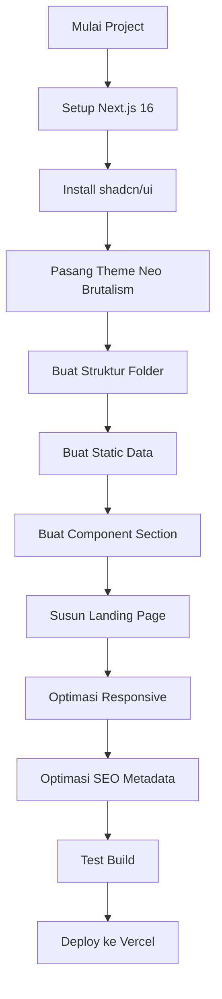
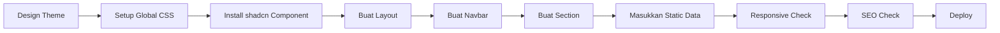

# Dokumentasi Workflow Web Portofolio Static

## Next.js 16 + shadcn/ui + Neo Brutalism

## 1. Ringkasan

Website portofolio static ini digunakan untuk menampilkan profil, skill, project, pengalaman, kontak, dan personal branding developer.

Stack utama:

| Kebutuhan    | Teknologi                             |
| ------------ | ------------------------------------- |
| Framework    | Next.js 16                            |
| UI Component | shadcn/ui                             |
| Styling      | Tailwind CSS v4                       |
| Tema         | Neo Brutalism                         |
| Data         | Static data / JSON / TypeScript array |
| Deployment   | Vercel                                |

Karena website ini static, tidak perlu database, backend, atau Prisma. Buat agar Seo 100%

---

# 2. Prasyarat

Pastikan sudah install:

```bash
node -v
npm -v
```

Minimal disarankan:

```bash
Node.js 20+
npm 10+
```

---

# 3. Struktur Folder

```bash
frontend/
├── app/
│   ├── globals.css
│   ├── layout.tsx
│   └── page.tsx
│
├── components/
│   ├── sections/
│   │   ├── hero-section.tsx
│   │   ├── about-section.tsx
│   │   ├── skill-section.tsx
│   │   ├── project-section.tsx
│   │   ├── experience-section.tsx
│   │   └── contact-section.tsx
│   │
│   ├── shared/
│   │   ├── navbar.tsx
│   │   ├── footer.tsx
│   │   └── brutal-card.tsx
│   │
│   └── ui/
│
├── data/
│   ├── projects.ts
│   ├── skills.ts
│   └── experiences.ts
│
├── public/
│   ├── images/
│   └── resume.pdf
│
├── components.json
├── package.json
└── next.config.ts
```

---

# 4. Langkah-langkah Utama

## 4.1 Buat Project Next.js

```bash
npx create-next-app@latest frontend
```

Pilih konfigurasi:

```bash
TypeScript: Yes
Tailwind CSS: Yes
App Router: Yes
src directory: Optional
Turbopack: Yes
Import alias: Yes
```

Masuk folder project:

```bash
cd frontend
```

---

## 4.2 Install shadcn/ui

```bash
npx shadcn@latest init
```

Tambahkan component yang dibutuhkan:

```bash
npx shadcn@latest add button card badge separator sheet
```
gunakan mcp di shadcn ui nya
---

# 5. Contoh Colour Palette CSS Neo Brutalism

Masukkan ke `app/globals.css`:

```css
@import "tailwindcss";

@custom-variant dark (&:is(.dark *));

:root {
  --background: oklch(1.0000 0 0);
  --foreground: oklch(0 0 0);
  --card: oklch(1.0000 0 0);
  --card-foreground: oklch(0 0 0);
  --popover: oklch(1.0000 0 0);
  --popover-foreground: oklch(0 0 0);
  --primary: oklch(0.6489 0.2370 26.9728);
  --primary-foreground: oklch(1.0000 0 0);
  --secondary: oklch(0.9680 0.2110 109.7692);
  --secondary-foreground: oklch(0 0 0);
  --muted: oklch(0.9551 0 0);
  --muted-foreground: oklch(0.3211 0 0);
  --accent: oklch(0.5635 0.2408 260.8178);
  --accent-foreground: oklch(1.0000 0 0);
  --destructive: oklch(0 0 0);
  --destructive-foreground: oklch(1.0000 0 0);
  --border: oklch(0 0 0);
  --input: oklch(0 0 0);
  --ring: oklch(0.6489 0.2370 26.9728);
  --chart-1: oklch(0.6489 0.2370 26.9728);
  --chart-2: oklch(0.9680 0.2110 109.7692);
  --chart-3: oklch(0.5635 0.2408 260.8178);
  --chart-4: oklch(0.7323 0.2492 142.4953);
  --chart-5: oklch(0.5931 0.2726 328.3634);
  --sidebar: oklch(0.9551 0 0);
  --sidebar-foreground: oklch(0 0 0);
  --sidebar-primary: oklch(0.6489 0.2370 26.9728);
  --sidebar-primary-foreground: oklch(1.0000 0 0);
  --sidebar-accent: oklch(0.5635 0.2408 260.8178);
  --sidebar-accent-foreground: oklch(1.0000 0 0);
  --sidebar-border: oklch(0 0 0);
  --sidebar-ring: oklch(0.6489 0.2370 26.9728);
  --font-sans: DM Sans, sans-serif;
  --font-serif: ui-serif, Georgia, Cambria, "Times New Roman", Times, serif;
  --font-mono: Space Mono, monospace;
  --radius: 0px;
  --shadow-x: 4px;
  --shadow-y: 4px;
  --shadow-blur: 0px;
  --shadow-spread: 0px;
  --shadow-opacity: 1;
  --shadow-color: hsl(0 0% 0%);
  --shadow-2xs: 4px 4px 0px 0px hsl(0 0% 0% / 0.50);
  --shadow-xs: 4px 4px 0px 0px hsl(0 0% 0% / 0.50);
  --shadow-sm: 4px 4px 0px 0px hsl(0 0% 0% / 1.00), 4px 1px 2px -1px hsl(0 0% 0% / 1.00);
  --shadow: 4px 4px 0px 0px hsl(0 0% 0% / 1.00), 4px 1px 2px -1px hsl(0 0% 0% / 1.00);
  --shadow-md: 4px 4px 0px 0px hsl(0 0% 0% / 1.00), 4px 2px 4px -1px hsl(0 0% 0% / 1.00);
  --shadow-lg: 4px 4px 0px 0px hsl(0 0% 0% / 1.00), 4px 4px 6px -1px hsl(0 0% 0% / 1.00);
  --shadow-xl: 4px 4px 0px 0px hsl(0 0% 0% / 1.00), 4px 8px 10px -1px hsl(0 0% 0% / 1.00);
  --shadow-2xl: 4px 4px 0px 0px hsl(0 0% 0% / 2.50);
  --tracking-normal: 0em;
  --spacing: 0.25rem;
}

.dark {
  --background: oklch(0 0 0);
  --foreground: oklch(1.0000 0 0);
  --card: oklch(0.3211 0 0);
  --card-foreground: oklch(1.0000 0 0);
  --popover: oklch(0.3211 0 0);
  --popover-foreground: oklch(1.0000 0 0);
  --primary: oklch(0.7044 0.1872 23.1858);
  --primary-foreground: oklch(0 0 0);
  --secondary: oklch(0.9691 0.2005 109.6228);
  --secondary-foreground: oklch(0 0 0);
  --muted: oklch(0.2178 0 0);
  --muted-foreground: oklch(0.8452 0 0);
  --accent: oklch(0.6755 0.1765 252.2592);
  --accent-foreground: oklch(0 0 0);
  --destructive: oklch(1.0000 0 0);
  --destructive-foreground: oklch(0 0 0);
  --border: oklch(1.0000 0 0);
  --input: oklch(1.0000 0 0);
  --ring: oklch(0.7044 0.1872 23.1858);
  --chart-1: oklch(0.7044 0.1872 23.1858);
  --chart-2: oklch(0.9691 0.2005 109.6228);
  --chart-3: oklch(0.6755 0.1765 252.2592);
  --chart-4: oklch(0.7395 0.2268 142.8504);
  --chart-5: oklch(0.6131 0.2458 328.0714);
  --sidebar: oklch(0 0 0);
  --sidebar-foreground: oklch(1.0000 0 0);
  --sidebar-primary: oklch(0.7044 0.1872 23.1858);
  --sidebar-primary-foreground: oklch(0 0 0);
  --sidebar-accent: oklch(0.6755 0.1765 252.2592);
  --sidebar-accent-foreground: oklch(0 0 0);
  --sidebar-border: oklch(1.0000 0 0);
  --sidebar-ring: oklch(0.7044 0.1872 23.1858);
  --font-sans: DM Sans, sans-serif;
  --font-serif: ui-serif, Georgia, Cambria, "Times New Roman", Times, serif;
  --font-mono: Space Mono, monospace;
  --radius: 0px;
  --shadow-x: 4px;
  --shadow-y: 4px;
  --shadow-blur: 0px;
  --shadow-spread: 0px;
  --shadow-opacity: 1;
  --shadow-color: hsl(0 0% 0%);
  --shadow-2xs: 4px 4px 0px 0px hsl(0 0% 0% / 0.50);
  --shadow-xs: 4px 4px 0px 0px hsl(0 0% 0% / 0.50);
  --shadow-sm: 4px 4px 0px 0px hsl(0 0% 0% / 1.00), 4px 1px 2px -1px hsl(0 0% 0% / 1.00);
  --shadow: 4px 4px 0px 0px hsl(0 0% 0% / 1.00), 4px 1px 2px -1px hsl(0 0% 0% / 1.00);
  --shadow-md: 4px 4px 0px 0px hsl(0 0% 0% / 1.00), 4px 2px 4px -1px hsl(0 0% 0% / 1.00);
  --shadow-lg: 4px 4px 0px 0px hsl(0 0% 0% / 1.00), 4px 4px 6px -1px hsl(0 0% 0% / 1.00);
  --shadow-xl: 4px 4px 0px 0px hsl(0 0% 0% / 1.00), 4px 8px 10px -1px hsl(0 0% 0% / 1.00);
  --shadow-2xl: 4px 4px 0px 0px hsl(0 0% 0% / 2.50);
}

@theme inline {
  --color-background: var(--background);
  --color-foreground: var(--foreground);
  --color-card: var(--card);
  --color-card-foreground: var(--card-foreground);
  --color-popover: var(--popover);
  --color-popover-foreground: var(--popover-foreground);
  --color-primary: var(--primary);
  --color-primary-foreground: var(--primary-foreground);
  --color-secondary: var(--secondary);
  --color-secondary-foreground: var(--secondary-foreground);
  --color-muted: var(--muted);
  --color-muted-foreground: var(--muted-foreground);
  --color-accent: var(--accent);
  --color-accent-foreground: var(--accent-foreground);
  --color-destructive: var(--destructive);
  --color-destructive-foreground: var(--destructive-foreground);
  --color-border: var(--border);
  --color-input: var(--input);
  --color-ring: var(--ring);
  --color-chart-1: var(--chart-1);
  --color-chart-2: var(--chart-2);
  --color-chart-3: var(--chart-3);
  --color-chart-4: var(--chart-4);
  --color-chart-5: var(--chart-5);
  --color-sidebar: var(--sidebar);
  --color-sidebar-foreground: var(--sidebar-foreground);
  --color-sidebar-primary: var(--sidebar-primary);
  --color-sidebar-primary-foreground: var(--sidebar-primary-foreground);
  --color-sidebar-accent: var(--sidebar-accent);
  --color-sidebar-accent-foreground: var(--sidebar-accent-foreground);
  --color-sidebar-border: var(--sidebar-border);
  --color-sidebar-ring: var(--sidebar-ring);

  --font-sans: var(--font-sans);
  --font-mono: var(--font-mono);
  --font-serif: var(--font-serif);

  --radius-sm: calc(var(--radius) - 4px);
  --radius-md: calc(var(--radius) - 2px);
  --radius-lg: var(--radius);
  --radius-xl: calc(var(--radius) + 4px);

  --shadow-2xs: var(--shadow-2xs);
  --shadow-xs: var(--shadow-xs);
  --shadow-sm: var(--shadow-sm);
  --shadow: var(--shadow);
  --shadow-md: var(--shadow-md);
  --shadow-lg: var(--shadow-lg);
  --shadow-xl: var(--shadow-xl);
  --shadow-2xl: var(--shadow-2xl);
}

@layer base {
  * {
    @apply border-border outline-ring/50;
  }
  body {
    @apply bg-background text-foreground;
  }
}
```

---

# 6. Konsep Desain Neo Brutalism

Ciri utama:

| Elemen | Style                    |
| ------ | ------------------------ |
| Card   | Border hitam tebal       |
| Shadow | Keras, tanpa blur        |
| Radius | Kotak / `0px`            |
| Warna  | Kontras tinggi           |
| Font   | Bold dan tegas           |
| Button | Border hitam + shadow    |
| Layout | Grid sederhana tapi kuat |

Contoh class reusable:

```tsx
const brutalCard =
  "border-2 border-black bg-card shadow-[4px_4px_0px_0px_#000] rounded-none";
```

---

# 7. Workflow Pembuatan

## Input

| Input           | Keterangan                             |
| --------------- | -------------------------------------- |
| Data profil     | Nama, role, bio                        |
| Data skill      | Frontend, backend, tools               |
| Data project    | Nama project, gambar, tech stack, link |
| Data pengalaman | Freelance, internship, kerja           |
| Asset           | Foto, logo, CV                         |
| Theme           | Neo brutalism                          |

---

## Process



---

## Output

Website portofolio static berisi:

| Section    | Isi                               |
| ---------- | --------------------------------- |
| Hero       | Nama, role, CTA                   |
| About      | Ringkasan diri                    |
| Skills     | Tech stack                        |
| Projects   | Showcase project                  |
| Experience | Riwayat pengalaman                |
| Contact    | Email, WhatsApp, GitHub, LinkedIn |

---

# 8. Struktur Section Halaman

```bash
Home Page
├── Navbar
├── Hero Section
├── About Section
├── Skills Section
├── Projects Section
├── Experience Section
├── Contact Section
└── Footer
```

---

# 9. Contoh Data Static

```ts
// data/projects.ts

export const projects = [
  {
    title: "Digital Product Marketplace",
    description: "Website untuk menjual ebook dan asset digital.",
    tech: ["Next.js", "NestJS", "Prisma", "Midtrans"],
    image: "/images/project-1.png",
    github: "https://github.com/username/project",
    demo: "https://project-demo.vercel.app",
  },
];
```

---

# 10. Contoh Component Brutal Card

```tsx
// components/shared/brutal-card.tsx

import { cn } from "@/lib/utils";

type BrutalCardProps = {
  children: React.ReactNode;
  className?: string;
};

export function BrutalCard({ children, className }: BrutalCardProps) {
  return (
    <div
      className={cn(
        "border-2 border-black bg-card p-6 shadow-[4px_4px_0px_0px_#000] rounded-none",
        className
      )}
    >
      {children}
    </div>
  );
}
```

---

# 11. Contoh Hero Section

```tsx
// components/sections/hero-section.tsx

import { Button } from "@/components/ui/button";

export function HeroSection() {
  return (
    <section className="mx-auto grid min-h-[80vh] max-w-6xl place-items-center px-4 py-20">
      <div className="border-2 border-black bg-secondary p-8 shadow-[6px_6px_0px_0px_#000]">
        <p className="mb-4 inline-block border-2 border-black bg-primary px-3 py-1 text-primary-foreground">
          Fullstack Developer
        </p>

        <h1 className="max-w-3xl text-4xl font-black tracking-tight md:text-6xl">
          Saya membangun website modern yang cepat, tegas, dan siap dipakai.
        </h1>

        <p className="mt-5 max-w-2xl text-lg font-medium">
          Fokus pada Next.js, NestJS, Prisma, UI modern, dan solusi digital yang
          membantu bisnis tampil profesional.
        </p>

        <div className="mt-8 flex flex-wrap gap-4">
          <Button className="rounded-none border-2 border-black shadow-[4px_4px_0px_0px_#000]">
            Lihat Project
          </Button>

          <Button
            variant="outline"
            className="rounded-none border-2 border-black bg-background shadow-[4px_4px_0px_0px_#000]"
          >
            Hubungi Saya
          </Button>
        </div>
      </div>
    </section>
  );
}
```

---

# 12. Flowchart Detail Development



---

# 13. Checklist Pengerjaan

| Tahap                          | Status |
| ------------------------------ | ------ |
| Setup Next.js 16               | ☐      |
| Install shadcn/ui              | ☐      |
| Setup global CSS neo brutalism | ☐      |
| Buat navbar                    | ☐      |
| Buat hero section              | ☐      |
| Buat about section             | ☐      |
| Buat skills section            | ☐      |
| Buat projects section          | ☐      |
| Buat contact section           | ☐      |
| Responsive mobile              | ☐      |
| SEO metadata                   | ☐      |
| Deploy Vercel                  | ☐      |

---

# 14. Troubleshooting / FAQ

## Kenapa tidak pakai database?

Karena ini portofolio static. Data bisa disimpan di file TypeScript seperti `projects.ts`, `skills.ts`, dan `experiences.ts`.

## Apakah perlu NestJS?

Tidak perlu. NestJS digunakan kalau website butuh backend, auth, dashboard admin, atau API dinamis.

## Apakah bisa tetap SEO?

Bisa. Gunakan metadata di `app/layout.tsx` atau `app/page.tsx`.

## Apakah cocok untuk personal branding?

Cocok. Neo brutalism kuat secara visual, kontras tinggi, dan mudah terlihat unik dibanding portofolio biasa.

## Apakah bisa ditambah dark mode?

Bisa. Palette yang kamu sematkan sudah menyediakan konfigurasi `.dark`, jadi tinggal tambah toggle theme memakai `next-themes`.
